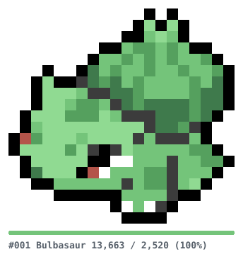

# pokemon-dot-daze

GitHub の累計 contribution 数に応じて、ポケモンのドット絵が少しずつ埋まっていく SVG を生成する Go ライブラリ + CLI です。

**10 contribution ごとに 1 ドット**が点灯します。1体目の Bulbasaur は有色 252 ドットなので、**2,520 contribution で完成**します。



## しくみ

1. GitHub GraphQL API から、アカウント作成年から今年までの contribution を年ごとに取得して合算する
2. `累計 ÷ 10` 個のドットを、**上の行から順に、行内は左から右へ**（ラスタースキャン）点灯させる
3. まだ点灯していないドットは薄いグレーの下地として描く（完成形のシルエットが見える）
4. SVG として書き出す

未点灯の色とキャプションの文字色は `prefers-color-scheme` に追従するので、GitHub のライトモード / ダークモードのどちらでも読めます。

## 使い方

### CLI

```bash
go run ./cmd/pokemon-dot-daze --user <あなたのGitHubログイン> --out assets/pokemon.svg
```

| フラグ | デフォルト | 説明 |
|---|---|---|
| `--user` | `$GITHUB_REPOSITORY_OWNER` | contribution を数える GitHub ログイン |
| `--token` | `$GITHUB_TOKEN` | GitHub API トークン |
| `--dex` | `1` | 描画するポケモンの図鑑番号 |
| `--out` | `assets/pokemon.svg` | 出力先 |
| `--cell` | `16` | 1ドットの一辺 (px) |
| `--gap` | `0` | ドット間の隙間 (px)。`2` などにするとビーズ図風になる |
| `--theme` | `auto` | `auto` / `light` / `dark` |
| `--caption` | `true` | 下部に名前と進捗を描画する |
| `--commits` | (未指定) | API を呼ばずにこの数値を使う（開発・テスト用） |

`--commits` を使えばトークンなしでオフライン確認できます。

```bash
go run ./cmd/pokemon-dot-daze --commits 1000 --out /tmp/preview.svg
```

### ライブラリとして

```go
import (
    "github.com/NichiyaOba/pokemon-dot-daze/progress"
    "github.com/NichiyaOba/pokemon-dot-daze/render"
    "github.com/NichiyaOba/pokemon-dot-daze/sprite"
)

s, _ := sprite.ByDex(1)
p, _ := progress.Compute(s, 1000)
svg, _ := render.SVG(p, render.DefaultOptions())
```

### CI/CD

`.github/workflows/update.yml` が1日1回実行され、差分があるときだけ `assets/pokemon.svg` をコミットします。

> **コミット名義について**
> 自動コミットは必ず `github-actions[bot]` 名義で行います。リポジトリオーナー名義にすると、
> 自動コミット自体がオーナーの contribution を増やし、それが次回の実行で絵を進める、
> という自己増殖ループになるためです。

> **private contribution を含めたい場合**
> デフォルトの `GITHUB_TOKEN` では public contribution しか数えられません。
> private も含めるには `read:user` スコープの PAT を作成し、workflow の `GITHUB_TOKEN` に差し替えてください。

## ドット絵データについて

ドット絵はビーズ図から転写しています。転写ミスを検出するため、図の凡例にある色別カウントを
チェックサムとしてテストしています（`TestBulbasaurMatchesChartLegend`）。配置ミスは
ヒストグラムでは検出できないため、ASCII ゴールデンファイル（`sprite/testdata/bulbasaur.txt`）
でも固定しています。

新しいポケモンを追加するときは、`sprite/` にデータファイルを1つ足して `registry.go` に登録するだけです。

## 開発

```bash
go test ./... -cover          # テスト（全パッケージ 80%+）
go vet ./...
gofmt -l .

# ゴールデンファイルを更新する
UPDATE_GOLDEN=1 go test ./sprite/
```

出力は**決定的**です。同じ入力からは常にバイト単位で同じ SVG が生成されます。
CI が「変化がなければコミットしない」を成立させるための前提なので、
レンダラに非決定的な処理（map の走査順など）を入れないでください。
